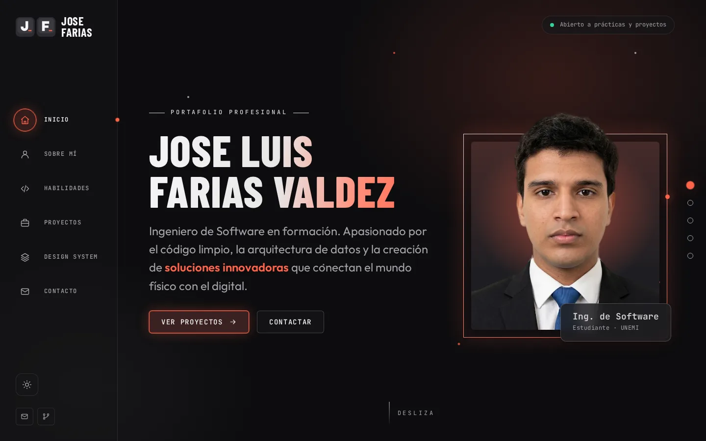
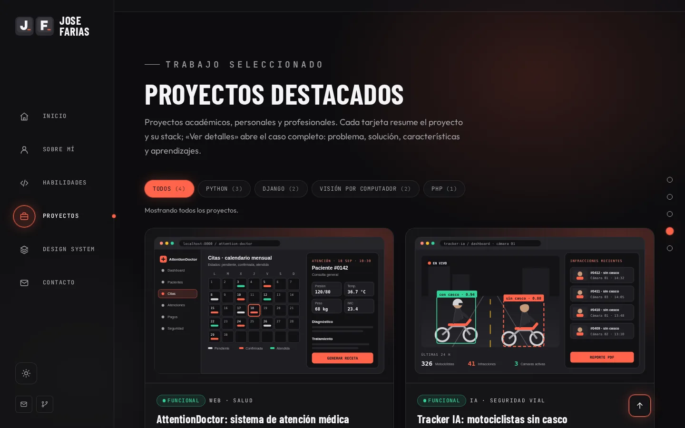
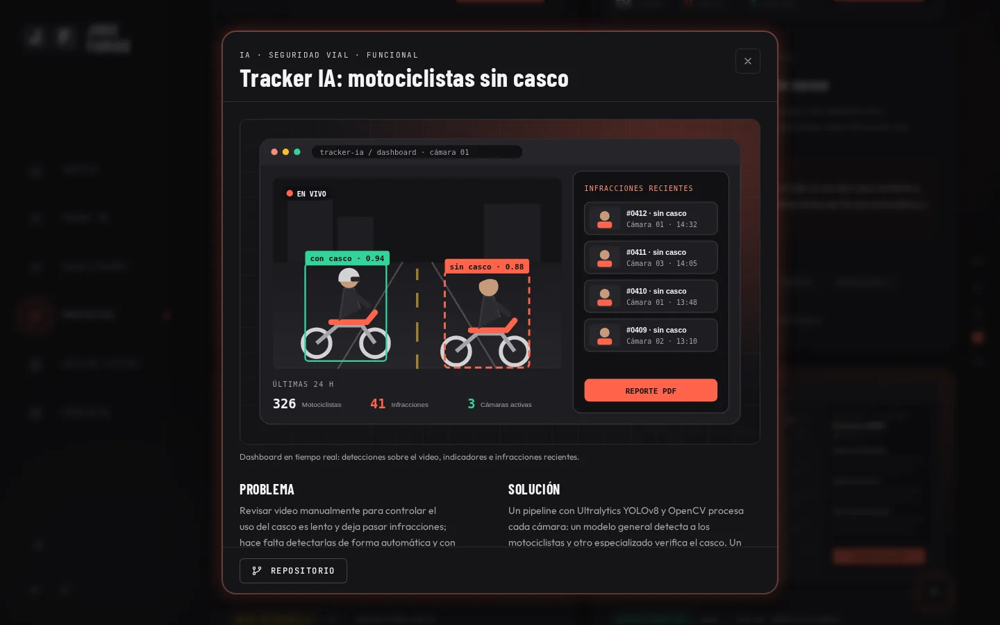
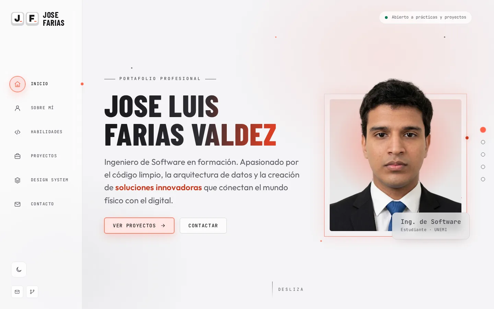
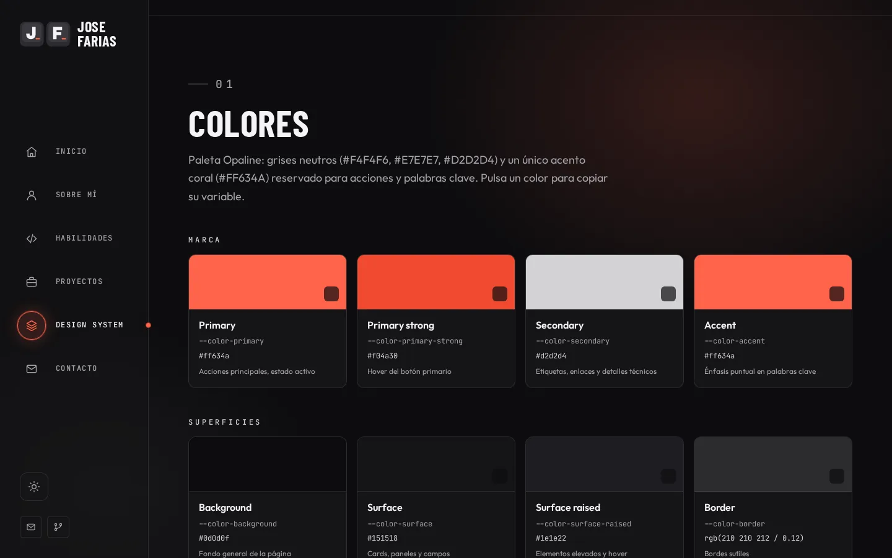
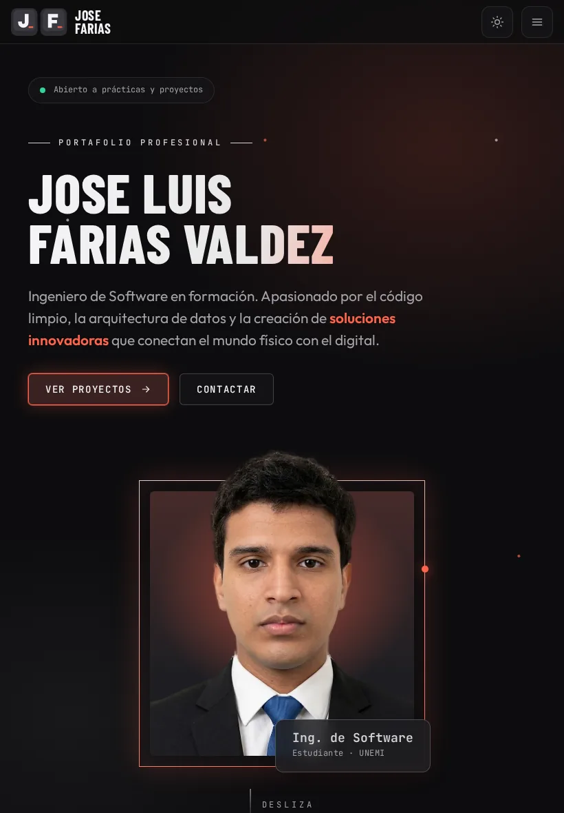
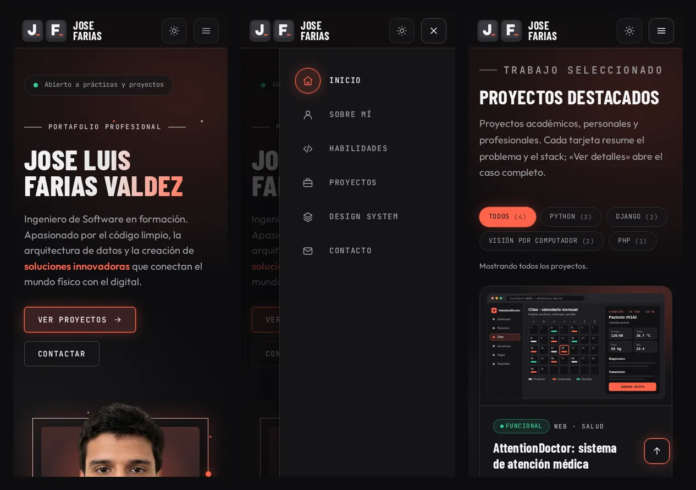

# Portafolio — Jose Luis Farias Valdez

Portafolio web personal e interactivo de **Jose Luis Farias Valdez**, estudiante de Ingeniería de Software en la Universidad Estatal de Milagro (UNEMI). Presenta mi perfil, mis habilidades técnicas y mis proyectos de desarrollo web con Python y Django y de visión por computador. Incluye una página **Design System / Componentes** documentada con los mismos componentes que usa el sitio.

- **Sitio publicado:** <https://0xfarias.github.io/portafolio/>
- **Repositorio:** <https://github.com/0xFarias/portafolio>



---

## Contenido

- [Secciones](#secciones)
- [Proyectos incluidos](#proyectos-incluidos)
- [Formación y certificaciones](#formación-y-certificaciones)
- [Tecnologías](#tecnologías)
- [Funcionalidades con JavaScript](#funcionalidades-con-javascript)
- [Estructura del proyecto](#estructura-del-proyecto)
- [Arquitectura CSS y Design System](#arquitectura-css-y-design-system)
- [Cómo visualizarlo](#cómo-visualizarlo)
- [Publicación en GitHub Pages](#publicación-en-github-pages)
- [Capturas](#capturas)
- [Control de versiones](#control-de-versiones)
- [Accesibilidad](#accesibilidad)
- [Créditos](#créditos)

## Secciones

| Sección | Contenido |
| --- | --- |
| **Inicio** | Nombre, perfil, propuesta de valor y llamadas a la acción. |
| **Sobre mí** | Perfil profesional, formación, certificaciones (AWS Academy Cloud Foundations y curso de Python y Django en Udemy), intereses e idiomas. |
| **Habilidades** | Cinco categorías (Backend y programación, Bases de datos, IA y visión por computador, Frontend, Cloud y herramientas) con nivel de dominio y evidencia de uso. |
| **Proyectos** | Cuatro proyectos en cards reutilizables: descripción, problema que resuelven, tecnologías, imagen y enlaces. |
| **Design System / Componentes** | Página propia ([design-system.html](design-system.html)) con colores, tipografía, espaciado, bordes, sombras, logotipo y componentes. |
| **Contacto** | Datos de contacto profesional y formulario con validación. |

## Proyectos incluidos

| Proyecto | Descripción | Tecnologías | Código |
| --- | --- | --- | --- |
| **AttentionDoctor** | Sistema de atención médica: pacientes, historia clínica, citas, atenciones, recetas y pagos. | Python, Django, PostgreSQL, Tailwind CSS | [Repositorio](https://github.com/0xFarias/AttentionDoctor) |
| **Tracker IA** | Detección en tiempo real de motociclistas sin casco, con dashboard, alertas y reportes PDF. | Python, Django, YOLOv8, OpenCV, WebSockets | [Repositorio](https://github.com/0xFarias/Tracker_IA) |
| **CocoaAnalyzer** | Detección de enfermedades en mazorcas de cacao con visión por computador. | Python, YOLOv11, FastAPI, Roboflow | No publicado |
| **AgendaValoraciones** | Calendario mensual para que los psicólogos de un hospital registren la evolución de sus pacientes. | PHP, MySQL | Privado (datos clínicos) |

## Formación y certificaciones

- **Ingeniería de Software** — Universidad Estatal de Milagro (UNEMI), 2023 – actualidad.
- **Curso completo de Python: desde 0 hasta proyectos con Django** — Udemy, 30 horas, septiembre de 2026. [Ver certificado](https://ude.my/UC-e4451a75-4604-483d-979d-471fdb543c91)
- **AWS Academy Graduate — Cloud Foundations** — octubre de 2025. [Ver insignia en Credly](https://www.credly.com/go/4g2S7dKG)

## Tecnologías

- **HTML5 semántico:** `header`, `nav`, `main`, `section`, `article`, `aside`, `footer`, `figure`, `figcaption`, `address`, `dialog`, `template`, `dl`.
- **CSS3 propio (sin frameworks):** custom properties, Flexbox, CSS Grid, media queries, container queries, `clamp()`, `color-mix()`.
- **JavaScript (ES2020+, sin dependencias):** módulos independientes, `IntersectionObserver`, `localStorage`, `<dialog>` nativo, Clipboard API.
- **Git y GitHub Pages** para control de versiones y publicación.
- **Fuentes autoalojadas:** Barlow Condensed, Outfit y JetBrains Mono (licencia OFL).

## Funcionalidades con JavaScript

| Archivo | Funcionalidad | Aporte a la experiencia |
| --- | --- | --- |
| `js/theme-init.js` + `js/modules/theme-toggle.js` | Tema claro/oscuro | Guarda la preferencia en **localStorage** y la aplica antes de pintar la página (sin parpadeo). |
| `js/modules/mobile-menu.js` | Menú responsive | Panel desplegable en móvil/tablet; se cierra con Escape, al elegir un enlace o al tocar fuera. |
| `js/modules/scroll-spy.js` | Navegación dinámica | Resalta la sección visible en la barra lateral y en los puntos de la derecha. |
| `js/modules/project-filter.js` | Filtro de proyectos por tecnología | Muestra cuántos proyectos usan cada tecnología y anuncia el resultado a lectores de pantalla. |
| `js/modules/project-modal.js` | Modal de proyectos | Abre el caso completo (problema, solución, características, rol) desde el `<template>` de cada card. |
| `js/modules/contact-form.js` | Validación del formulario | Mensajes claros por campo, contador de caracteres y envío mediante el cliente de correo. |
| `js/modules/reveal-on-scroll.js` | Animaciones controladas | Aparición suave al hacer scroll; se desactiva si el sistema pide reducir el movimiento. |
| `js/modules/back-to-top.js` | Volver al inicio | Botón flotante que aparece tras desplazarse. |
| `js/modules/toast.js` | Notificaciones | Mensajes breves de éxito/error (`role="status"`). |
| `js/modules/design-tokens.js` | Design System | Lee los valores reales de los tokens (cambian con el tema) y copia variables al portapapeles. |

## Estructura del proyecto

```text
portafolio/
├── index.html                 # Portada: inicio, sobre mí, habilidades, proyectos, contacto
├── design-system.html         # Documentación de tokens y componentes
├── README.md
├── css/
│   ├── main.css               # Punto de entrada: importa las capas en orden
│   ├── base/                  # tokens, fuentes, reset, tipografía, utilidades
│   ├── layout/                # estructura (barra lateral), secciones, footer
│   ├── components/            # logotipo, botones, badges, navbar, cards, skills, filtros, formularios, modal, feedback
│   └── pages/                 # estilos propios de cada página
├── js/
│   ├── theme-init.js          # se carga en <head>
│   └── modules/               # una funcionalidad por archivo
├── assets/
│   ├── fonts/                 # woff2 autoalojadas + licencia
│   ├── icons/favicon.svg      # logotipo de una tecla (se adapta al tema del sistema)
│   └── img/                   # fotografía de perfil, imagen para redes e ilustraciones de los proyectos
└── docs/capturas/             # capturas usadas en este README
```

## Arquitectura CSS y Design System

Los estilos se organizan por capas (`base → layout → components → pages`) y **todas las decisiones visuales viven en `css/base/tokens.css`** como custom properties: colores, tipografía, escala de espaciado (base 4px), bordes, radios, sombras, tamaños, duraciones y capas (`z-index`). Los componentes solo consumen esas variables, por eso el tema claro se implementa redefiniendo únicamente los tokens en `:root[data-theme="light"]`.

La página **Design System** muestra la paleta con su valor real (leído desde CSS), la escala tipográfica, el espaciado y ejemplos vivos de cada componente con su código HTML. Los componentes que aparecen allí son exactamente los del portafolio (mismas clases, mismo JavaScript).

### Identidad visual

**Paleta Opaline:** grises neutros y un único acento coral, el mismo en ambos temas.

| Color | Uso |
| --- | --- |
| `#F4F4F6` | Texto en tema oscuro / fondo en tema claro |
| `#E7E7E7` | Superficies elevadas y bordes en tema claro |
| `#D2D2D4` | Detalles técnicos, etiquetas y bordes |
| `#FF634A` | Acento coral: acciones, estado activo y palabras clave |

**Logotipo «teclas guía»:** la J y la F son las teclas con marca táctil en cualquier teclado; el logotipo las usa como iniciales y la barra coral hace de cursor. Es un SVG en línea cuyos colores salen de los tokens `--logo-*`, así que cambia con el tema, y sus teclas se presionan al pasar el cursor.

Breakpoints (mobile-first): **< 40rem** teléfono · **40–64rem** tablet · **≥ 64rem** escritorio con barra lateral · **≥ 80rem** navegación por puntos.

## Cómo visualizarlo

**Opción 1 — Abrir el archivo:** doble clic en `index.html`. Funciona sin servidor (fuentes, imágenes y JavaScript cargan con `file://`).

**Opción 2 — Servidor local (recomendado):**

- Visual Studio Code: extensión **Live Server** → clic derecho en `index.html` → *Open with Live Server*.
- O desde la terminal, en la carpeta del proyecto:

  ```bash
  python -m http.server 8000
  ```

  y abrir <http://localhost:8000>.

## Publicación en GitHub Pages

1. Subir el proyecto a un repositorio **público** en GitHub.
2. En el repositorio: **Settings → Pages**.
3. En *Build and deployment* elegir **Deploy from a branch**, rama `main` y carpeta `/ (root)`. Guardar.
4. Esperar uno o dos minutos y abrir <https://0xfarias.github.io/portafolio/>.

## Capturas

| Escritorio — proyectos | Detalle de proyecto (modal) |
| --- | --- |
|  |  |

| Tema claro | Design System |
| --- | --- |
|  |  |

### Tablet y móvil





## Control de versiones

El portafolio se construyó por etapas, con un commit por cada avance:

1. Estructura inicial del repositorio (`README.md`, `.gitignore`, `.editorconfig`).
2. HTML semántico de la portada con la información del CV.
3. Design tokens (paleta Opaline), fuentes y estilos base.
4. Certificado de Python y Django y README con el avance del proyecto.
5. Layout y componentes reutilizables.
6. Estilos de la portada y diseño responsive.
7. Interactividad con JavaScript.
8. Página Design System / Componentes.
9. Corrección: la leyenda de niveles descuadraba el encabezado de Habilidades en pantallas grandes.
10. Actualización de los textos de la portada.
11. Fotografía profesional sin fondo que sobresale del marco (reemplaza al avatar ilustrado).
12. Fondo liso: se quita la cuadrícula decorativa.
13. Documentación final, capturas y publicación en GitHub Pages.

## Accesibilidad

- Enlace «Saltar al contenido», foco visible en todos los controles y navegación completa por teclado.
- Jerarquía de encabezados `h1 → h4` sin saltos; landmarks con nombre accesible.
- Formularios con `label`, `aria-invalid` y mensajes de error vinculados con `aria-describedby`.
- Textos alternativos descriptivos en todas las imágenes; íconos decorativos con `aria-hidden`.
- Contraste revisado en ambos temas y respeto a `prefers-reduced-motion`.

## Créditos

- Diseño y desarrollo: **Jose Luis Farias Valdez**.
- Fuentes: [Barlow Condensed](https://fonts.google.com/specimen/Barlow+Condensed), [Outfit](https://fonts.google.com/specimen/Outfit) y [JetBrains Mono](https://www.jetbrains.com/lp/mono/), bajo SIL Open Font License 1.1.
- Íconos e ilustraciones: SVG propios del proyecto.

Asignatura: **Desarrollo Web** — Ingeniería de Software, UNEMI.
